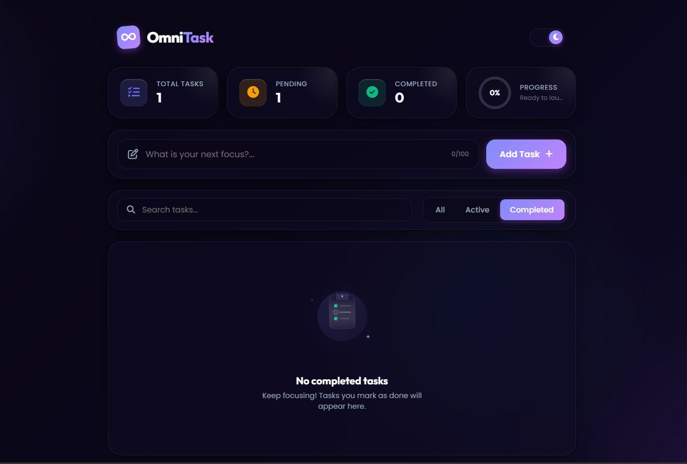

<div align="center">
  
  # ✨ OmniTask - Premium Task Management
  
  **A beautiful, glassmorphic To-Do list web application designed for a seamless, visually stunning, and highly functional user experience.**

  [](https://developer.mozilla.org/en-US/docs/Glossary/HTML5)
  [](https://developer.mozilla.org/en-US/docs/Web/CSS)
  [](https://developer.mozilla.org/en-US/docs/Web/JavaScript)
  [](https://opensource.org/licenses/MIT)

</div>

<br />

## 📖 Table of Contents
- [About the Project](#-about-the-project)
- [Key Features](#-key-features)
- [Tech Stack](#-tech-stack)
- [Getting Started](#-getting-started)
- [Folder Structure](#-folder-structure)
- [Contributing](#-contributing)
- [License](#-license)
- [Contact](#-contact)

---

## 🚀 About the Project

OmniTask elevates the standard to-do app by prioritizing a beautiful design system alongside productive functionality. With a modern **glassmorphic UI**, animated decorative glowing orbs, and dynamic SVG circular progress metrics, managing tasks is both engaging and satisfying. 

All your data—including tasks, visual theme preferences, and active filters—is automatically saved to your browser's **Local Storage**, meaning your progress is never lost, even if you refresh or close the page.

**🌟 Live Demo:** [https://vadsolakishan.github.io/To-Do-List-Web-App/](https://vadsolakishan.github.io/To-Do-List-Web-App/)

[](https://vadsolakishan.github.io/To-Do-List-Web-App/)

---

## ✨ Key Features

- 🎨 **Glassmorphic UI**: Beautiful, modern aesthetics utilizing backdrop filters, sleek gradient accents, and smooth transitions.
- 🌓 **Light & Dark Themes**: Fully robust theme toggle switch. Your preferred mode is saved in Local Storage.
- 📊 **Visual Dashboard & Live Stats**: Real-time tracking of total, pending, and completed tasks, accompanied by a dynamic SVG circular progress ring.
- 🔍 **Advanced Filtering & Search**: Find specific tasks instantly with the real-time search engine, or sort by 'All', 'Active', and 'Completed'.
- 💬 **Toast Notifications**: Context-aware popups provide immediate, non-intrusive feedback when you add, complete, or delete tasks.
- 💾 **Local Storage Persistence**: Your data securely survives page reloads.
- 🛡️ **Input Validation**: Includes a real-time character counter (max 100 chars) preventing empty or duplicate active tasks.
- 🎬 **Smooth Animations**: Carefully composed keyframe animations for filtering sliders, checkmarks, floating backgrounds, and task entrances/exits.

---

## 🛠️ Tech Stack

OmniTask is built entirely using vanilla web technologies, requiring no complex configurations or bundlers.

* **HTML5**: Semantic tagging and precise SVG drawings with a focus on accessibility.
* **CSS3**: CSS Custom Properties (Variables) for theming, Flexbox/Grid for layout, keyframe animations, and Glassmorphism techniques.
* **JavaScript (ES6+)**: Pure vanilla modular JavaScript, DOM manipulation, custom event handling, and Web Storage API mapping.
* **Google Fonts**: *Poppins* & *Outfit*.
* **Font Awesome**: Premium vector icon integrations.

---

## 🏁 Getting Started

OmniTask requires **no backend server**, database, or exact build integrations to run. It works straight out of the box!

### Prerequisites
- A modern web browser (Chrome, Firefox, Safari, Edge)

### Installation & Run Steps

1. **Clone the Repository:**
   ```bash
   git clone https://github.com/VadsolaKishan/To-Do-List-Web-App.git
   ```
2. **Navigate to the Directory:**
   ```bash
   cd To-Do-List-Web-App
   ```
3. **Launch the Application:**
   * Simply double-click on the `index.html` file to run it in your default web browser.
   * **Recommended:** If you use VS Code, install the [Live Server](https://marketplace.visualstudio.com/items?itemName=ritwickdey.LiveServer) extension, right-click `index.html`, and select *Open with Live Server*.

---

## 📁 Folder Structure

```text
📦 To-Do-List-Web-App
 ┣ 📜 index.html    # Main HTML markup and application skeleton
 ┣ 📜 style.css     # Core stylesheet, theme variables, and UI animations
 ┣ 📜 app.js        # Business logic, state management, and DOM interactions
 ┗ 📜 README.md     # Project documentation
```

---

## 🤝 Contributing

Contributions make the open-source community an amazing place to learn, inspire, and create. Any contributions you make are **greatly appreciated**.

1. Fork the Project
2. Create your Feature Branch (`git checkout -b feature/AmazingFeature`)
3. Commit your Changes (`git commit -m 'Add some AmazingFeature'`)
4. Push to the Branch (`git push origin feature/AmazingFeature`)
5. Open a Pull Request

---

## 📝 License

Distributed under the MIT License. See `LICENSE` for more information.

---

## 📫 Contact

**Kishan Vadsola**

- 📧 Email: [vadsolakishan1310@gmail.com](mailto:vadsolakishan1310@gmail.com)
- 🐙 GitHub: [@VadsolaKishan](https://github.com/VadsolaKishan)
- 💼 LinkedIn: [Kishan Vadsola](https://www.linkedin.com/in/kishan-vadsola-a68b05331)

**Project Link:** [https://github.com/VadsolaKishan/To-Do-List-Web-App](https://github.com/VadsolaKishan/To-Do-List-Web-App)

<br />

<div align="center">
  Made with ❤️ by Kishan Vadsola
</div>